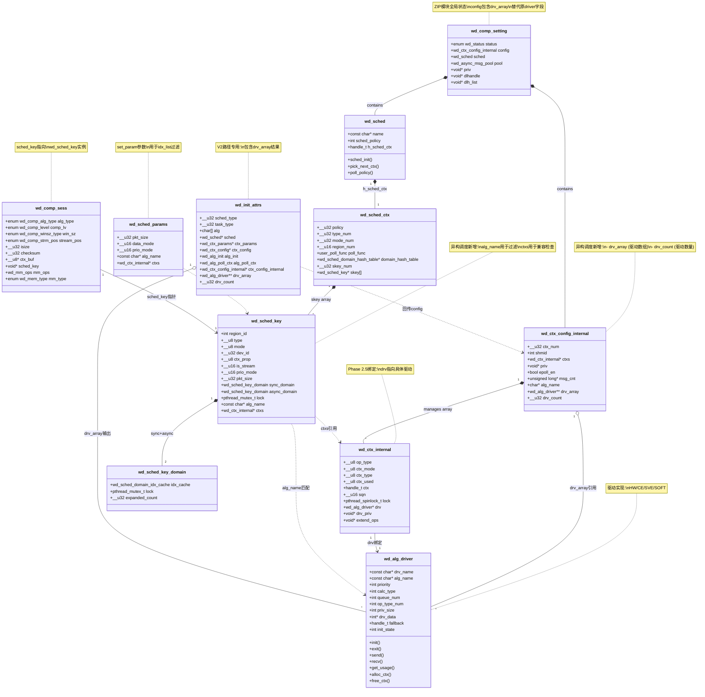

# ZIP异构调度适配结构体关系图

## 核心结构体概览

ZIP异构调度适配涉及以下核心结构体，它们通过指针引用形成层次化管理架构。

---

## 结构图 (Mermaid)



---

## 层次结构详解

### 1. 全局配置层

```
┌─────────────────────────────────────┐
│       wd_comp_setting               │
│   (ZIP模块全局单例)                  │
├─────────────────────────────────────┤
│  status      │ 模块初始化状态        │
│  config      │ ctx配置（含drv_array）│
│  sched       │ 调度器接口            │
│  pool        │ 异步消息池            │
│  priv        │ 替代原driver字段      │
│  dlhandle    │ V1动态库句柄          │
│  dlh_list    │ V2动态库链表          │
└─────────────────────────────────────┘
         │                    │
         ▼                    ▼
   [config]               [sched]
```

**异构调度变化**：
- 删除 `driver` 字段（单驱动指针）
- 新增 `priv` 字段（通用私有数据）
- `config` 内部新增 `drv_array` 和 `drv_count`

---

### 2. Context配置层

```
┌─────────────────────────────────────────────┐
│      wd_ctx_config_internal                 │
│   (内部ctx配置，异构调度核心)                │
├─────────────────────────────────────────────┤
│  ctx_num       │ ctx数量                    │
│  ctxs[]        │ ctx数组指针                │──────► wd_ctx_internal[]
│  drv_array[]   │ 驱动数组指针     [新增]    │──────► wd_alg_driver*[]
│  drv_count     │ 驱动数量         [新增]    │
│  alg_name      │ 支持的算法列表             │
│  epoll_en      │ epoll开关                  │
│  msg_cnt       │ 消息计数统计               │
└─────────────────────────────────────────────┘
```

**异构调度新增字段**：
| 字段 | 类型 | 作用 |
|------|------|------|
| `drv_array` | `wd_alg_driver**` | Phase 1发现的驱动数组 |
| `drv_count` | `__u32` | 驱动数组长度 |

---

### 3. Context层

```
┌─────────────────────────────────────┐
│      wd_ctx_internal                │
│   (单个ctx运行实例)                  │
├─────────────────────────────────────┤
│  op_type   │ 操作类型(comp/decomp)  │
│  ctx_mode  │ SYNC/ASYNC模式         │
│  ctx       │ 硬件ctx句柄            │
│  drv       │ 绑定的驱动指针         │──────► wd_alg_driver
│  drv_priv  │ 驱动私有数据           │
│  lock      │ ctx自旋锁              │
└─────────────────────────────────────┘
```

**Phase 2.5绑定**：
- `drv` 字段在 `wd_ctx_bind_drivers()` 中RR轮询绑定到具体驱动
- 每个ctx绑定一个驱动，多ctx可绑定不同驱动实现异构

---

### 4. 驱动层

```
┌─────────────────────────────────────────────┐
│           wd_alg_driver                     │
│   (驱动实现接口)                             │
├─────────────────────────────────────────────┤
│  drv_name    │ 驱动名称 (hisi_zip/isa_ce)   │
│  alg_name    │ 支持的算法                   │
│  priority    │ 优先级                       │
│  calc_type   │ 计算类型(HW/CE/SVE/SOFT)     │
│  queue_num   │ 队列数量                     │
│  init()      │ 驱动初始化                   │
│  exit()      │ 驱动退出                     │
│  send()      │ 发送请求                     │
│  recv()      │ 接收响应                     │
│  alloc_ctx() │ 分配硬件ctx                  │
│  free_ctx()  │ 释放硬件ctx                  │
└─────────────────────────────────────────────┘
```

**驱动类型**：
| calc_type | 示例驱动 | 特点 |
|-----------|---------|------|
| HW | hisi_zip | 硬件加速，高吞吐 |
| CE | isa_ce | ARM NEON指令集，低延迟 |
| SVE | isa_sve | ARM SVE指令集，并行 |
| SOFT | soft_zip | 纯软件实现 |

---

### 5. 调度器层

```
┌─────────────────────────────────────┐
│          wd_sched                   │
│   (调度器接口)                       │
├─────────────────────────────────────┤
│  name           │ 调度器名称         │
│  sched_policy   │ 调度策略           │
│  sched_init()   │ 创建sched_key     │
│  pick_next_ctx()│ 选择下一个ctx     │
│  set_param()    │ 过滤idx_list      │ [新增]
│  h_sched_ctx    │ 调度器上下文       │──────► wd_sched_ctx
└─────────────────────────────────────┘
```

**异构调度新增接口**：
- `set_param()` 根据算法名过滤可用ctx列表

---

### 6. Session调度层

```
┌─────────────────────────────────────────────┐
│          wd_sched_key                       │
│   (Session级调度key，核心调度实体)           │
├─────────────────────────────────────────────┤
│  region_id     │ 区域标识(NUMA/设备)        │
│  type          │ 操作类型                   │
│  mode          │ SYNC/ASYNC模式             │
│  dev_id        │ 设备ID                     │
│  ctx_prop      │ ctx属性                    │
│  is_stream     │ 流模式标志                 │
│  prio_mode     │ 优先级模式                 │
│  pkt_size      │ 数据包大小                 │
│  sync_domain   │ 同步域                     │──► idx_cache[]
│  async_domain  │ 异步域                     │──► idx_cache[]
│  alg_name      │ 算法名称         [新增]    │
│  ctxs          │ ctx数组引用     [新增]     │──► wd_ctx_internal[]
└─────────────────────────────────────────────┘
```

**异构调度新增字段**：
| 字段 | 类型 | 作用 |
|------|------|------|
| `alg_name` | `const char*` | 用于驱动算法匹配 |
| `ctxs` | `wd_ctx_internal*` | 用于遍历ctx检查兼容性 |

---

### 7. V2初始化属性层

```
┌─────────────────────────────────────────────┐
│          wd_init_attrs                      │
│   (V2路径初始化属性)                         │
├─────────────────────────────────────────────┤
│  sched_type       │ 调度策略类型            │
│  task_type        │ 任务类型(HW/CE/SVE)     │
│  alg[]            │ 算法名称                │
│  sched            │ 调度器                  │
│  ctx_params       │ ctx参数                 │
│  alg_init         │ 初始化回调              │
│  alg_poll_ctx     │ poll回调                │
│  ctx_config_internal │ 内部config回传 [新增]│
│  drv_array        │ 驱动数组       [新增]   │──────► wd_alg_driver*[]
│  drv_count        │ 驱动数量       [新增]   │
└─────────────────────────────────────────────┘
```

**异构调度新增字段**：
| 字段 | 类型 | 作用 |
|------|------|------|
| `task_type` | `__u32` | 决定驱动发现路径 |
| `ctx_config_internal` | `wd_ctx_config_internal*` | V2回传config指针 |
| `drv_array` | `wd_alg_driver**` | Phase 1结果输出 |
| `drv_count` | `__u32` | 驱动数量输出 |

---

### 8. Session层

```
┌─────────────────────────────────────────────┐
│          wd_comp_sess                       │
│   (ZIP Session实例)                          │
├─────────────────────────────────────────────┤
│  alg_type    │ 算法类型(zlib/gzip...)       │
│  comp_lv     │ 压缩级别                     │
│  win_sz      │ 窗口大小                     │
│  stream_pos  │ 流位置状态                   │
│  checksum    │ 校验和                       │
│  ctx_buf     │ 流状态缓冲                   │
│  sched_key   │ 调度key指针                  │──────► wd_sched_key
│  mm_ops      │ 内存操作接口                 │
│  mm_type     │ 内存类型                     │
└─────────────────────────────────────────────┘
```

---

## 数据流路径

### 初始化阶段

```
wd_comp_init2_()
    │
    ├──► wd_init_attrs (设置task_type/alg)
    │        │
    │        ├──► wd_alg_attrs_init()
    │        │      │
    │        │      ├──► wd_get_drv_array() ──► drv_array[]
    │        │      │                         │
    │        │      │                         ├── hisi_zip
    │        │      │                         ├── isa_ce
    │        │      │                         └── isa_sve
    │        │      │
    │        │      └──► wd_alg_ctx_init()
    │        │             │
    │        │             └──► wd_ctx_config_internal.ctxs[]
    │        │
    │        └► drv_array输出到attrs
    │
    ├──► wd_ctx_bind_drivers(config, drv_array)
    │        │
    │        └──► ctxs[0].drv = drv_array[0]  (RR轮询)
    │        └──► ctxs[1].drv = drv_array[1]
    │        └──► ctxs[2].drv = drv_array[0]
    │        └──► ...
    │
    └──► wd_alg_init_driver(config)
             │
             └──► ctxs[i].drv->init()
```

### Session创建阶段

```
wd_comp_alloc_sess(setup)
    │
    ├──► wd_drv_alg_support(alg_name, config)
    │        │
    │        └──► 遍历ctxs检查 drv->alg_name匹配
    │        └──► 返回 true/false
    │
    ├──► sched.sched_init() ──► wd_sched_key
    │        │
    │        └──► 创建sync_domain.idx_cache
    │        └──► 创建async_domain.idx_cache
    │        └──► 设置wd_sched_key.alg_name
    │        └──► 设置wd_sched_key.ctxs
    │
    └──► sched.set_param(h_sched_ctx, sched_key, params)
             │
             └──► 根据alg_name过滤idx_cache.idx_list
             └──► 只保留驱动兼容的ctx索引
```

### 请求处理阶段

```
wd_comp_do_comp_sync(req)
    │
    ├──► sched.pick_next_ctx(sched_key, mode)
    │        │
    │        └──► 从idx_list选择最小负载ctx
    │        └──► 返回ctx索引
    │
    ├──► ctx = config.ctxs[idx]
    │
    └──► ctx.drv->send(ctx.ctx, msg)  [异构：不同ctx可能用不同drv]
             │
             ├──► hisi_zip->send()  [ctx绑定了hisi_zip]
             └──► isa_ce->send()   [ctx绑定了isa_ce]
```

---

## 异构调度关键关系

### drv_array → ctxs 绑定关系

```
drv_array[0]: hisi_zip    ──┬──► ctxs[0].drv
                            ├──► ctxs[2].drv
                            ├──► ctxs[4].drv
drv_array[1]: isa_ce      ──┼──► ctxs[1].drv
                            ├──► ctxs[3].drv
                            ├──► ctxs[5].drv
drv_array[2]: isa_sve     ──┴──► ctxs[6].drv
                                  ctxs[7].drv
```

**绑定规则**（RR轮询）：
- `ctxs[i].drv = drv_array[i % drv_count]`
- 相同驱动的ctx数量尽量均衡

### sched_key → ctx 过滤关系

```
wd_sched_key
    │
    ├── alg_name = "zlib"
    │
    ├── sync_domain.idx_cache.idx_list[]
    │        │
    │        ├── [0] ──► ctxs[0] (drv=hisi_zip) ✓ 支持
    │        ├── [1] ──► ctxs[1] (drv=isa_ce)   ✓ 支持
    │        ├── [2] ──► ctxs[2] (drv=hisi_zip) ✓ 支持
    │        └── [3] ──► ctxs[3] (drv=isa_ce)   ✓ 支持
    │
    └── set_param过滤后：
         idx_list = [0, 1, 2, 3]  (全部支持zlib)
```

**过滤规则**：
- 遍历所有ctx，检查 `ctx.drv->alg_name` 是否匹配 `sched_key.alg_name`
- 只保留兼容的ctx索引到 `idx_list`

---

## 总结

ZIP异构调度适配通过以下结构体字段新增实现多驱动支持：

| 层次 | 结构体 | 新增字段 | 作用 |
|------|--------|---------|------|
| 配置层 | `wd_ctx_config_internal` | `drv_array`, `drv_count` | 存储驱动数组 |
| Context层 | `wd_ctx_internal` | `drv` (已有，新用法) | Phase 2.5绑定 |
| 调度层 | `wd_sched` | `set_param()` | 过滤idx_list |
| Session层 | `wd_sched_key` | `alg_name`, `ctxs` | 算法匹配依据 |
| 初始化层 | `wd_init_attrs` | `drv_array`, `drv_count` | Phase 1结果输出 |

这些字段形成完整的异构调度数据链：**驱动发现 → 驱动绑定 → 算法过滤 → 动态调度**。