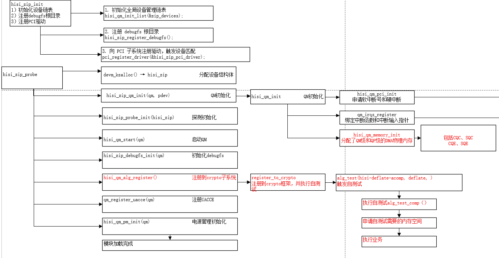
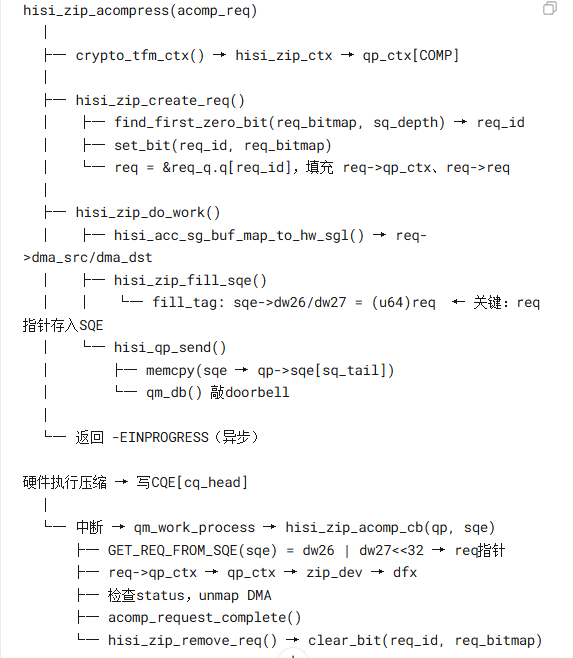
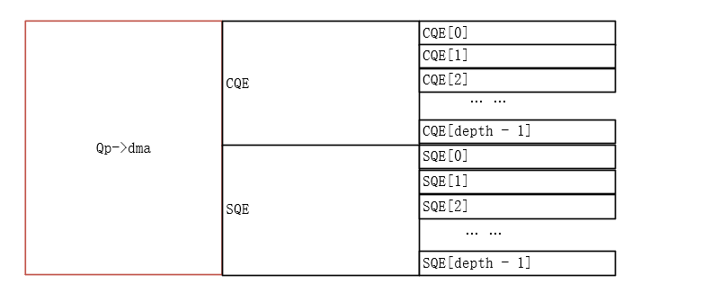
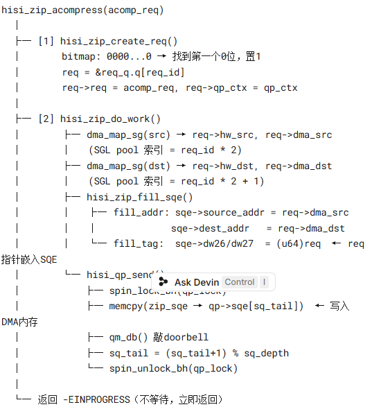
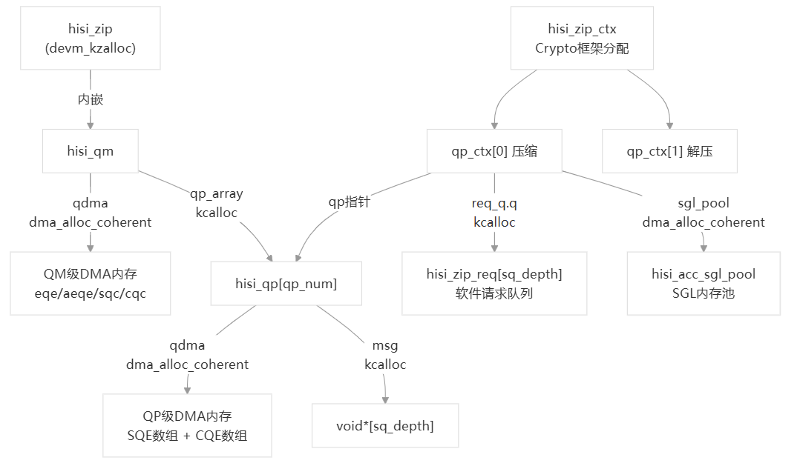
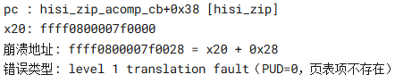
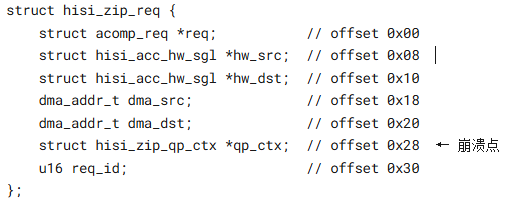

一、程序执行流程



<details>
<summary>图片内容（OCR提取）</summary>

```
hisi_zip_init
1) 初始化设备管理链表
2) 注册 debugfs 根目录 [hisi_qm_init_list(&zip_devices)]
3) 注册 PCI 驱动
   pci_register_driver(&hisi_zip_pci_driver)

hisi_zip_probe:
  hisi_zip_probe_init(hisi_zip) - 探测初始化
  hisi_qm_memory_init(qm, pdev) - QM内存初始化
  hisi_zip_register_debugfs() - 注册debugfs
  hisi_zip_alg_register() - 注册到crypto子系统
    register_to_crypto_alg_test(hisi-deflate/acomp/deflate)
  hisi_zip_pm_init() - 电源管理初始化
```

</details>


<details>
<summary>图片内容（OCR提取）</summary>

*注：EMF格式图片，OCR无法提取内容*

</details>



<details>
<summary>图片内容（OCR提取）</summary>

```
hisi_zip_acompress(acomp_req)
│
├── crypto_tfm_ctx() → hisi_zip_ctx → qp_ctx[COMP]
│
├── hisi_zip_create_req()
│   ├── find_first_zero_bit(req_bitmap, sq_depth) → req_id
│   ├── set_bit(req_id, req_bitmap)
│   └── req = &req_q.q[req_id], 填充 req->qp_ctx、req->req
│
├── hisi_zip_do_work()
│   ├── hisi_acc_sg_buf_map_to_hw_sgl() → req->dma_src/dma_dst
│   └── hisi_zip_fill_sqe()
│       └── fill_tag: sqe->dw26/dw27 = (u64)req  ← 关键: req指针存入SQE
│
├── hisi_qp_send()
│   ├── memcpy(sqe → qp->sqe[sq_tail])
│   └── qm_db() - doorbell
│
├── 返回 -EINPROGRESS (异步)
│
硬件执行压缩 → 写 CQE[cq_head]
│
├── 中断 → qm_work_process → hisi_zip_acomp_cb(qp, sqe)
│   ├── GET_REQ_FROM_SQE(sqe) = dw26 | dw27<<32 → req指针
│   ├── req->qp_ctx → qp_ctx → zip_dev → dfx
│   ├── 检查 status，unmap DMA
│   └── acomp_request_complete()
│
└── hisi_zip_remove_req() → clear_bit(req_id, req_bitmap)
```

</details>

二、内存管理过程

1.1 驱动加载阶段（insmod hisi_zip.ko → hisi_zip_probe）

驱动加载时，内存分配分为两个层次：QM级别（全局，设备生命周期内有效）和QP级别（每个队列对独立）。

QM级别内存

一次 dma_alloc_coherent 分配连续DMA内存，内部切分为四段，指针存于 hisi_qm.qdma

hisi_qm.qdma.va（连续DMA内存）

├── qm->eqe → qm_eqe[eq_depth] 事件队列

├── qm->aeqe → qm_aeqe[aeq_depth] 异步事件队列

├── qm->sqc → qm_sqc[qp_num] 所有QP的SQ上下文表

└── qm->cqc → qm_cqc[qp_num] 所有QP的CQ上下文表

QP级别内存（每个QP独立DMA内存）

每个QP一次 dma_alloc_coherent，SQE数组和CQE数组共享同一块DMA内存

hisi_qp.qdma.va（每QP独立DMA内存）

├── [0 .. sqe_size*sq_depth-1] → qp->sqe SQE/BD数组（硬件读取）

├── [off .. off+cq_depth*cqe_size] → qp->cqe CQE数组（硬件写入）

└── [PAGE_ALIGN后+PAGE_SIZE] → 状态页

其中 off = sqe_size * sq_depth，SQE与CQE在物理上连续，无间隙。



<details>
<summary>图片内容（OCR提取）</summary>

```
[内存结构图示 - QP级别DMA内存布局]
```

</details>

req 池的创建：

hisi_zip_acomp_init 中创建。

1、bitmap + spinlock 原子操作：find_first_zero_bit + set_bit 在同一个 spin_lock 区间内完成，多个 CPU 并发申请时不会拿到同一个 req_id。

2、固定槽位映射：req_id 直接对应 req_q.q[req_id]。



<details>
<summary>图片内容（OCR提取）</summary>

```
hisi_zip_acompress(acomp_req)
│
├── [1] hisi_zip_create_req()
│   ├── bitmap: 0000...0 → 找到第一个0位，置1
│   ├── req = &req_q.q[req_id]
│   └── req->req = acomp_req, req->qp_ctx = qp_ctx
│
├── [2] hisi_zip_do_work()
│   ├── dma_map_sg(src) → req->hw_src, req->dma_src
│   │   (SGL pool 索引 = req_id * 2)
│   ├── dma_map_sg(dst) → req->hw_dst, req->dma_dst
│   │   (SGL pool 索引 = req_id * 2 + 1)
│   └── hisi_zip_fill_sqe()
│       ├── fill addr: sqe->source_addr = req->dma_src
│       │              sqe->dest_addr = req->dma_dst
│       └── fill_tag: sqe->dw26/dw27 = (u64)req ← req指针写入SQE
│
├── hisi_qp_send()
│   ├── spin_lock_bh(qp_lock)
│   ├── memcpy(zip_sqe → qp->sqe[sq_tail]) - 写入DMA内存
│   ├── qm_db() - doorbell
│   ├── sq_tail = (sq_tail+1) % sq_depth
│   └── spin_unlock_bh(qp_lock)
│
└── 返回 -EINPROGRESS (不等待，立即返回)
```

</details>

1.2 Crypto tfm初始化阶段（hisi_zip_acomp_init）

每次 crypto_alloc_acomp() 时，Crypto框架按 cra_ctxsize = sizeof(struct hisi_zip_ctx) 分配上下文，crypto_tfm_ctx() 直接返回该内存指针

hisi_zip_ctx（Crypto框架分配，嵌在tfm对象尾部）

├── qp_ctx[0]（压缩）

│ ├── qp → 指向 qm->qp_array[i]（借用，非新分配）

│ ├── req_q.q → hisi_zip_req[sq_depth]（kcalloc，软件请求队列）

│ ├── req_q.req_bitmap → bitmap（bitmap_zalloc，空闲槽位图）

│ └── sgl_pool → hisi_acc_sgl_pool（dma_alloc_coherent，SGL内存池）

└── qp_ctx[1]（解压，同上）



<details>
<summary>图片内容（OCR提取）</summary>

```
hisi_zip → hisi_zip_ctx (Crypto框架分配)
           (devm_kzalloc)
│
├── qp_ctx[0] 压缩          qp_ctx[1] 解压
│   ├── qp指针              ├── qp指针
│   ├── req_q.q             ├── req_q.q
│   │   kcalloc             │   kcalloc
│   │   hisi_zip_req[sq_depth]
│   │   软件请求队列
│   └── sgl_pool            └── sgl_pool
│       dma_alloc_coherent      dma_alloc_coherent
│       hisi_acc_sgl_pool       hisi_acc_sgl_pool
│       SGL内存池               SGL内存池
│
└── qm级DMA内存
    hisi_qm → qdma
    dma_alloc_coherent
    eqe/aeqe/sqc/cqc
```

</details>

三、Crash根因分析与证明



<details>
<summary>图片内容（OCR提取）</summary>

```
Crash现场信息:
pc: hisi_zip_acomp_cb+0x38 [hisi_zip]
x20: ffff8800007f0000
访问地址: ffff8800007f0028 = x20 + 0x28
错误类型: level 1 translation fault (PUD=0, 页表项不存在)
```

</details>

x20寄存器持有 req 指针（ffff0800007f0000），在 hisi_zip_acomp_cb 第3行（+0x38）访问 req->qp_ctx（偏移0x28）时触发page fault。该地址的PUD为0，说明对应物理页已被完全释放



<details>
<summary>图片内容（OCR提取）</summary>

```c
struct hisi_zip_req {
    struct acomp_req *req;           // offset 0x00
    struct hisi_acc_hw_sgl hw_src;   // offset 0x08
    struct hisi_acc_hw_sgl hw_dst;   // offset 0x10
    dma_addr_t dma_src;              // offset 0x18
    dma_addr_t dma_dst;              // offset 0x20
    struct hisi_zip_qp_ctx *qp_ctx;  // offset 0x28 ← 崩溃点
    u16 req_id;                      // offset 0x30
};
```

</details>

以下几点证明正常业务路径的内存访问是安全的：

1、req_bitmap保护：hisi_zip_create_req 通过 find_first_zero_bit 分配 req_id，bitmap大小等于 sq_depth，保证 req_id < sq_depth，req_q.q[req_id] 不越界。

2、tag机制保证req指针完整性：hisi_zip_fill_tag 将 req 指针的低32位和高32位分别存入 sqe->dw26/dw27，GET_REQ_FROM_SQE 完整恢复64位指针，无截断风险。

3、DMA映射错误检测：hisi_acc_sg_buf_map_to_hw_sgl 对 index >= pool->count、dma_map_sg 返回值、SGE数量超限均有检查，失败时返回 ERR_PTR，调用方用 IS_ERR 检查。

4、硬件执行结果验证：hisi_zip_acomp_cb 中通过 ops->get_status(sqe) 检查硬件返回的status字段，异常时记录 dfx->err_bd_cnt 并向上层返回 -EIO。

5、CQE读取一致性：dma_rmb() 内存屏障 + QM_CQE_PHASE 相位位双重保护，确保只处理硬件真正写入的CQE。